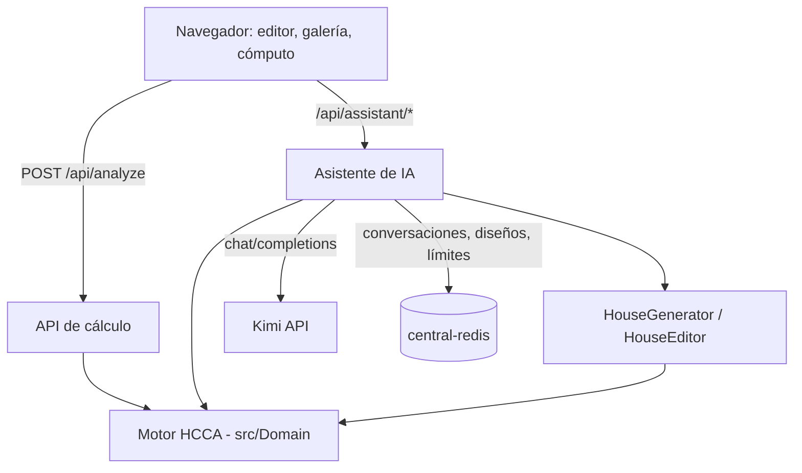
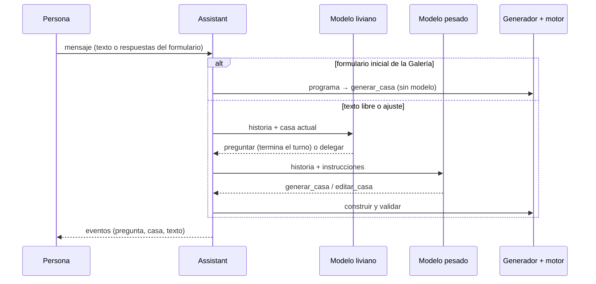

# Arquitectura — Blockk Studio

## Arquitectura

Una aplicación Symfony monolítica y sin estado para el cálculo, con el editor en el navegador. **El motor de cálculo es
la única fuente de las reglas constructivas y vive en PHP** (`src/Domain`, sin dependencias del framework): el cliente
dibuja y arma intenciones («agregar un muro»), el servidor normaliza, valida y calcula, y el cliente reemplaza su estado
con la respuesta. El asistente de IA es una capa aparte (`src/Assistant`) que usa ese mismo motor como herramienta.

## Componentes

| Componente | Qué hace | Dónde |
| --- | --- | --- |
| Editor (navegador) | Herramientas, cámara isométrica/planta, render Canvas 2D por algoritmo del pintor, paneles, deshacer/rehacer, guardado en `localStorage` | `assets/editor/` |
| Cómputo, Galería, Catálogo | Páginas Twig + módulos ES: exportación CSV/PDF (generados en el navegador), plantillas, fichas | `templates/`, `assets/{bom,gallery,catalog}/` |
| API de cálculo | `POST /api/analyze` y afines; sin estado | `src/Controller/Api/ProjectApiController.php` |
| Motor (dominio) | Normalización, topología, ambientes, hiladas, cortes, madera, losas, escaleras, techos, cómputo, validación, sol | `src/Domain/` |
| Generador y editor de casas | Programa de ambientes → casa válida; operaciones puntuales sobre un proyecto | `src/Domain/Design/` |
| Asistente de IA | Conversación, herramientas, dos modelos (liviano/pesado), persistencia, límites | `src/Assistant/`, `src/Controller/Api/AssistantController.php`, `assets/lib/ai-chat.js` |
| Kimi (externo) | LLM por API compatible con OpenAI | `KIMI_*` |
| Redis (lab) | Conversaciones, diseños por navegador y contadores de uso | `REDIS_URL` |

## Diagrama

Pipeline del análisis (`ProjectAnalyzer`):

```mermaid
graph LR
    F[ProjectFactory<br/>valida e hidrata] --> N[WallNormalizer<br/>T, cruces, fusiones]
    N --> T[Topology<br/>nodos y encuentros]
    T --> R[RegionAnalyzer<br/>ambientes]
    R --> C[CourseBuilder<br/>hiladas, trabas, U]
    C --> K[StockPacker + CutPlanner<br/>cortes]
    K --> P[Timber / Slab / Stair / Roof planners]
    P --> B[BomCalculator<br/>cómputo y precios]
    B --> V[ProjectValidator<br/>observaciones]
```

Un turno del asistente:

## Datos

- **Proyecto** (`v1`, JSON): `{name, north, lat, lot:{w,d}, settings, upper, roofs:[…], levels:[{walls, openings,
  ubeams, timber, slabs, stairs}, …]}`. Lo valida `ProjectFactory` (frontera de confianza: tipos, rangos, ids,
  espesores, presets y presupuestos de tamaño).
- **Unidades**: coordenadas del proyecto en unidades de **12,5 cm** (enteros); geometría interna en **ticks de 0,5 mm**
  (12,5 cm = 250 ticks), así no hay errores de coma flotante en trabas y remanentes.
- **Asistente** (Redis, 60 días, claves con prefijo `blockk:`): `conv:{id}` (historia para el modelo, eventos para la
  interfaz, casa actual y su programa), `design:{id}` y el índice `designs:{cliente}`, contadores `rl:*`.

## API

| Método y ruta | Descripción |
| --- | --- |
| `POST /api/analyze` | Proyecto → `{project (normalizado), analysis: {levels, timber, floors, roof, bom, issues, telemetry}}`; `422` si es inválido. |
| `POST /api/suggest` | Sugerencias bioclimáticas de aberturas. |
| `GET /api/solar?lat=&season=` | Trayectoria solar (06:00–19:00 cada 15 min). |
| `GET /api/templates`, `GET /api/templates/{slug}` | Plantillas de la Galería. |
| `POST /api/thumbnail` | Miniatura SVG de un proyecto. |
| `GET /api/calc/panel?…` | Calculadora rápida de paño. |
| `GET /api/assistant/status` | ¿Está configurado el asistente? |
| `POST /api/assistant/conversations` | Nueva conversación `{client, modo, inicio:{tipo: nueva\|plantilla\|proyecto, …}, texto?, respuestas?}`. |
| `POST /api/assistant/conversations/{id}/messages` | Mensaje `{client, texto?, respuestas?, project?}`. |
| `GET /api/assistant/conversations/{id}`, `GET /api/assistant/designs[/{id}]` | Retomar una conversación; diseños del navegador. |

## Decisiones y trade-offs

- **Reglas sólo en el servidor.** El cliente no duplica reglas: para validar en vivo (p. ej. dónde entra una puerta) el
  servidor devuelve los tramos libres de cada muro. Costo: una ida y vuelta por edición (~50 ms por análisis de una
  casa de 2 plantas).
- **Sin base de datos para el editor.** El proyecto vive en el navegador: cero cuentas y cero datos personales; a
  cambio no hay proyectos compartidos. Redis sólo para el asistente.
- **La IA no dibuja.** El modelo elige un programa o una operación y el código construye y valida; así toda casa que
  muestra la IA pasa la misma Revisión que una dibujada a mano. Costo: el generador sólo produce plantas en «tira».
- **Dos modelos.** Uno liviano (barato) coordina y pregunta; uno pesado arma el JSON y las acciones. El formulario
  inicial no usa ningún modelo (la primera casa sale en < 1 s).
- **Sin paso de build en el front** (AssetMapper + import maps nativos): menos herramientas; a cambio, sin TypeScript
  ni bundling.
- **Render propio en Canvas 2D** (algoritmo del pintor por capas con orden topológico) en lugar de WebGL: liviano y
  exacto para cajas alineadas; sostiene 60 FPS en casas de 2 plantas.

## Seguridad

Validación estricta en la frontera, límites de tamaño de cuerpo (1,5 MB), de muros y de complejidad; Twig con
autoescape y DOM sin `innerHTML` con datos del usuario (las miniaturas SVG del servidor se muestran como ``); CSP
restrictiva sin CDN, `X-Frame-Options`, `nosniff`. El asistente no tiene login: cada navegador usa un id aleatorio y
sólo accede a lo suyo; hay límites por IP, por día y por conversación porque cada mensaje consume el modelo. Las
claves (`KIMI_API_KEY`, `LAB_MCP_TOKEN`) nunca se versionan.

## Pendiente

- Exponer valores referenciales (pallets, consumos, precios) por distribuidor.
- Generador con más tipologías (L, patio central).
- Streaming de respuestas del modelo para no esperar el turno completo.
